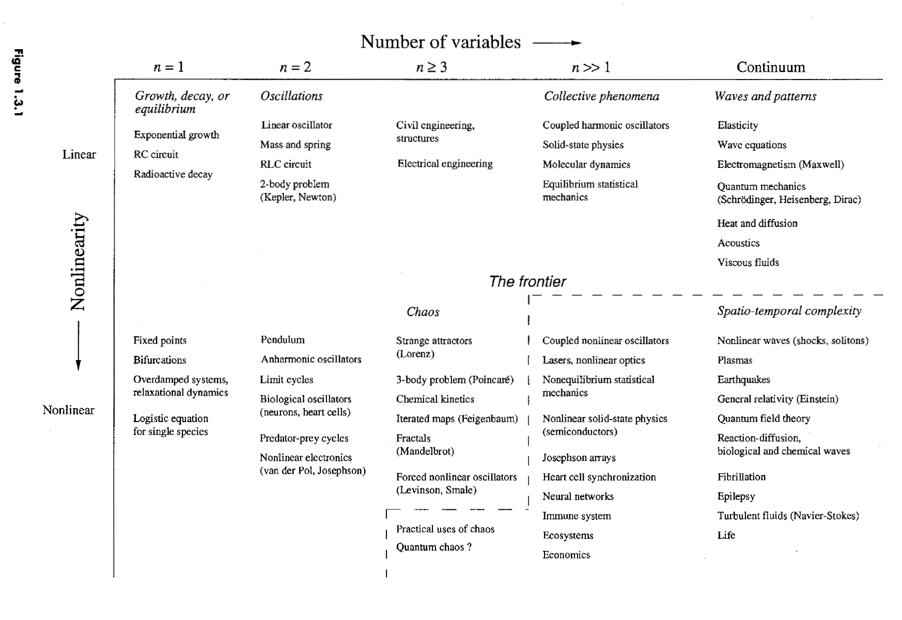

# Chapter 1

**Dynamics** as the overbearing subject dealing with change. Answers questions relating to:
- Does a system settle to **equilibrium**?
- Repeat in **cycles**?
- Do something **more complicated**?

## 1.1 Capsule History of Dynamics
1. 1666s: Newton
   - Newton invented calculus and discovered differential equations, laws of motion
   - Solved **2-body problem**
2. 1700s-1800s: Subsequent generations tried to solve **3-body problem**
   - Much harder (not tractable!) but why?
3. 1890s: Poincare
   - Qualitative questions:
     - Is the solar system forever **stable**?
   - Developed *geometric* approach
   - First to glimpse **chaos**
4. 1900s-1950s: Focus on nonlinear oscillators and their applications not on chaos
   - Relevant for technological advances, e.g. radio, lazers, radar
   - Mathematical innovation
5. 1950s as turning point: distribution of computers
   - Allowed for new kinds of experiments
6. 1963: Lorenz discovers Lorenz attractor
   - Trying to make weather predictions (convection rolls in atmosphere model)
   - Process is inherently unpredictable but structured (i.e. points fall on butterfly curves)
7. 1970s: Boom years for chaos
   - 1971 Ruelle and Takens - Turbulence
   - May and population biology
   - Feigenbaum and universal laws governing transitions between regular and chaotic systems
     - Link between chaos and phase transitions
   - Mandelbrot and fractals
   - Winfree and geometric methods applied to biological oscillations
8. 1980s: Widespread attention

Define **chaos**
    : Property of **deterministic systems** exhibiting **aperiodicity** depending sensitively on initial conditions. Impossible to predict long-term behavior.

------------------------------------------------------------

## 1.2 The Importance of Being Nonlinear
What are the **two main types** of **dynamical systems**?
: (1) Differential equations & (2) iterated maps (aka difference equations). How are these contrasted?
: Continuous vs discrete time, respectively

Nonlinear differential equations are much harder!

#### Example) pendulum is described by:
$$ \ddot x + \frac{g}{L} \sin x = 0$$

Writing in terms of single derivatives:
$$ \dot x_1 = x_2 $$
$$ \dot x_2 = -\frac{g}{L} \sin x_1 $$

How do we get around non-linearity in the pendulum equation?
- Small-angle approximation

Is this even necessary?
- No, we can actually solve the pendulum analytically with elliptic curves.

How would we go about addressing this problem using geometric techniques?
- Suppose we know a solution for a given initial condition (pair of functions $x_1(t)$ and $x_2(t)$).
- Construct a space with coordinates $(x_1, x_2)$,  "**phase space**".
- Our solution is a **trajectory** through phase space.
- **Goal:** Run process in reverse. Draw trajectories then extract information about solutions.

## Nonautonomous Systems

How do we generalize our approach when the equations we are trying to solve have **explicit time dependence**? (called a **nonautonomous** system)
- Introduce new variable $x_3=t$, then $\dot x_3 = 1$

#### Example) Forced HO
$$ m \ddot x + b \dot x + k x = F \cos t $$
becomes . . .
$$ \dot x_1 = x_2 $$
$$ \dot x_2 = \frac{1}{m}\left(-k x_1 - b x_2 + F \cos x_3 \right) $$
$$ \dot x_3 = 1 $$

Why is this change of variables useful?
1. Geometric picture: We can visualize a phase space with *frozen-in* trajectories.
2. Physically: the state of our equation is uniquely determined by the 3 numbers.

What is the cost?
- Nontraditional terminology: e.g. forced HO becomes third-order nonlinear system instead of the typical second-order linear equation.

What is the relation between time-dependence and the dimensionality of phase space?
: Autonomous systems: $n$-th order equation yields $n$-dimensional system
: Nonautonomous systems: $n$-th order equation yields $(n+1)$-dimensional system

Why are nonlinear systems so much harder to solve analytically?
- Linear systems we can break into parts that we can solve separately.

------------------------------------------------------------

## 1.3 A Dynamical View of the World

Logical structure of entire book captured by two axes:
1. Number of variables needed to characterize state of system (dimension of phase space)
2. Linearity / nonlinearity

