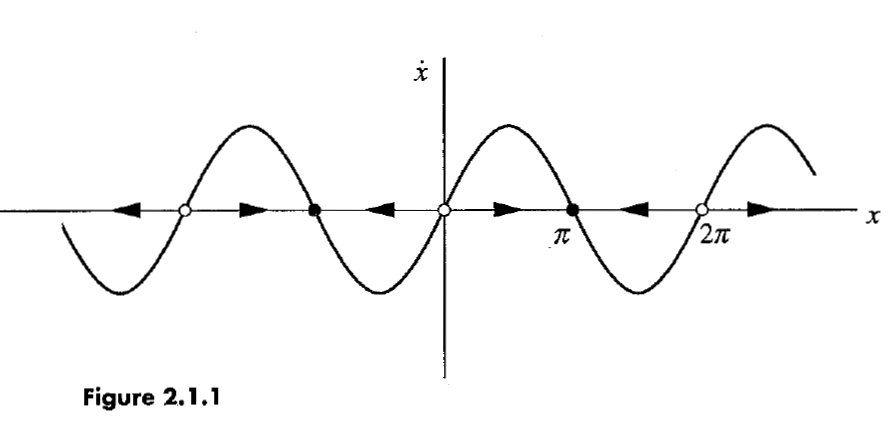
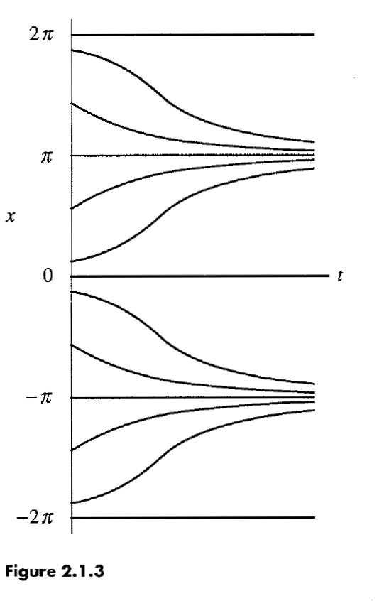
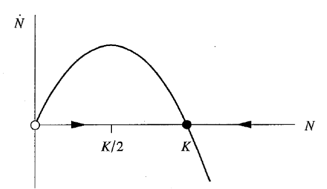

# Chapter 2
## Flows on the Line

------------------------------------------------------------

## 2.0 Introduction

Consider general nth-order differential equation (i.e. n sets of first order differential equations).

Begin with the simplest case: **First-order equation**

$$ \dot x = f(x). $$

What do we mean by **system**?
- A dynamical system, not in the sense of a collection of two or more equations

Can $f$ have time-dependence?
- No, as we saw in the first chapter, we should treat time as any another variable, which would make this a second-order system.

------------------------------------------------------------

## 2.1  A Geometric Way of Thinking
### Example of interpreting differential equations as vector fields

$$ \dot x = \sin x $$

Solve this by separation of variables:

$$ t = \ln | \frac{\csc x_0 + \cot x_0}{\csc x + \cot x} |.$$

This is exact but untransparent.

But if we plot this in phase space, it's extremely transparent.

We can identify **fixed points** when $\dot x = 0$, alternatingly **stable** or **unstable**.

We can plot the trajectories, *qualitatively*.

------------------------------------------------------------

## 2.2 Fixed Points and Stability

Fixed points as **equilibrium solutions**.
Fixed points tell us appearance of phase portrait.

Contrast *local* and *global* stability: We usually mean the former (i.e. resilience to small disturbances)

A few good examples on analyzing fixed points:
- Parabola
- RC circuit
$$ \dot x = x - \cos x $$

------------------------------------------------------------

## 2.3 Population Growth

Simplest model is exponential.

$$ \dot N = rN $$

with solutions

$$ N(t) = N_0 e^{rt} $$

How do we introduce a **carrying capacity**?
- Assume that the per capita growth rate $\dot N/ N$ decreases linearly with $N$.

The **Logistic equation**
$$ \dot N = rN \left(1-\frac{N}{K}\right) $$

What does it look like in phase space?

Who was the logistic equation proposed by?
: Verhulst. When?
: 1838

What is the intellectual history of the logistic equation?
: Originally it was argued to be universal law of growth (Pearl 1927)

How well does the logistic equation match up to real population growth?
: For simple organisms (yiest, bacteria, etc.) - the comparisons are pretty good.
: For more complex organisms (fruit flies, flour beetles, etc.) - the populations continue to fluctuate persistently after initial logistic growth period.

------------------------------------------------------------

## 2.4 Linear Stability Analysis

How to get a more exact, quantitative measure of stability (e.g. rate of decay to stable fixed point)?
- *Linearize* around the fixed point

Consider:
Fixed point, $x^*$.
Small perturbation away $$ \eta(t)=x(t)-x^* << 1 \text{ as } t\rightarrow 0 $$

We want to determine a differential equation for $\eta$:
$\dot \eta = \frac{d}{dt}(x-x^*) = \dot x$
Expand about fixed point: $\dot \eta = f(x^*) + \eta f'(x^*) + O(\eta^2)$

The **linearization**:
$\dot \eta \approx \eta f'(x*)$

How does this determine stability?
$f'(x^*) > 0$: perturbation grows with time
$f'(x^*) < 0$: perturbation decays with time
$f'(x^*) = 0$: nonlinear analysis needed

What is the **characeristic time scale** of a fixed point? Qualitatively?
The time required for $x(t)$ to vary significantly in the neighboorhood of the fixed point? Mathematically?
$1/|f'(x^*)|$

Examples of calculating fixed point stability quantitatively
$\dot x = \sin x$
Logistic equation
Example where you need to take higher order terms in your Taylor expansion
 - **half-stable**

------------------------------------------------------------

# 2.5 Existence and Uniqueness

So far we've ignored these issues (reflecting applied spirit of book).
There are, however, pathological cases

#### Example of non-unique solution
$$ \dot x = x^{1/3},$$
where $x(0)=$ 0$.

Has two solutions:
1. $x(t)=0$
2. $x(t)=\left(\frac{2}{3}t\right)^{3/2}$

In fact, **infinitely**-many solutions?
- Hint: fixed point is very unstable with infinite slope of $f'(0)$

What is the **Existence and Uniqueness Theorem**? Given some IVP ($\dot x = f(x)$, $x(0)=x_0$)?
: If $f(x)$ and $f'(x)$ are continuous on an open interval $R$ containing $x_0$, then . . .
: Then IVP has a unique solution $x(t)$ on somoe time interval $(-\tau, \tau)$ containing $t=0$. What about outside of these intervals?
: This does not guarantee that solutions exist forever.

#### Example of applying Existence and Uniqueness Thoerem
$$\dot x =  1+x^2$$
$$x(0) = x_0$$

$ f(x)=1+x^2 $ is continuous and has continuous derivatives for all of space.

Imposing $x(0)=0$ leads to (by separation of variables), the solution:
$$  \tan^{-1} x = t $$

This only exists for the range of times $(-\pi/2, \pi/2)$.

Why is this incredible?
- **Blow-up**: The solution reaches infinity in finite time. Indeed relevant in models of combustion.

------------------------------------------------------------

## 2.6 Impossibility of Oscillations

What things can happen for a vector field on the real line?
:  Trajectories either approach fixed points or diverge to $\pm \infty$. They cannot oscillate.

Why can't vector fields on the real line oscillate?
: They are forced to change monotonically. The phase points never reverse directions.
: Topologically: monotonic behavior on a line can never bring you back to the starting place.

How does this match up with classical mechanical expectations from damped oscillators?
: The over-damped limit tin which the second order derivative vanishes does not allow for any overshooting.

------------------------------------------------------------

## 2.7 Potentials

What is the **potential** $V(x) for a given first-order differential equation?
: It is defined so that: $f(x)= -\frac{dV}{dx}.$
: Indeed, when $f(x)$ is negative it measn $V has positive curvature and is stable (and positive => negative curvatrue => unstable).

Examples: Single-well and double-well potentials

------------------------------------------------------------

# 2.8 Solving Equations on the Computer

What is **Euler's Method** used for?
: Approximating solutions $x(t)$ to first order differential equations subject to initial conditions.

How do we use **Euler's Method** to approximate solutions $x(t)$ to first order differential equations subject to initial conditions?
: We iteratively update our value of position according to the rule: $x_{n+1} = x_n + f(x_n)\Delta t \approx x(t_n)$

What does the **improved Euler method** change? TODO: Link card
: 1. Take a trial step $\tilde{x}_{n+1} = x_n + f(x_n)\Delta t$
: 2. Average $f(x_n)$ and $f(\tilde{x}_{n+1})$, and use that to take the real step.

How is the **improved Euler method** an improvement? TODO: Link card
: It makes a smaller **error** $E = |x(t_n)-x_n|$ for a given stepsize, i.e. this decreases to 0 quadratically as $\Delta t$ goese to 0, whereas the original error decreases linearly.

Why not just take much higher order approximations?
- Tradeoff between computing higher orders and the accuracy

What is the **fourth-order Runge-Kutta method**? TODO: links cards
: Define $$k_1=f(x_n)\Delta t$$ $$k_2=f(x_n+\frac{1}{2}k_1)\Delta t$$ $$k_3=f(x_n+\frac{1}{2}k_2)\Delta t$$ $$k_4=f(x_n+k_3)\Delta t$$
: Calculate $x_{n+1}=x_n+\frac{1}{6}(k_1+2k_2+2k_3+k_4).$
