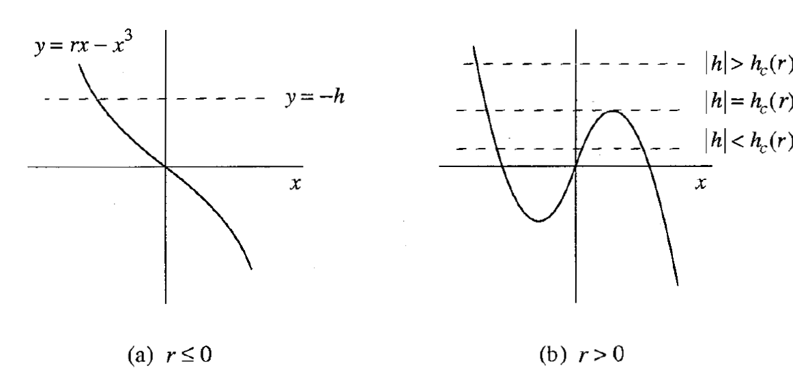

# Chapter 3
## Bifurcations

------------------------------------------------------------

## 3.0 Introduction

What is interesting about 1-D systems if their dynamics are so trivial?
- The dependence on parameters. Qualitative structure of flow changes as parameters are varied.

What do we call qualitative changes in the dynamics of 1-D systems as we vary parameters?
: Bifurcations. These occur at bifurcation points.

How do we distinguish varying parameters from variables like $x$ and $t$?
: Parameters are uncoupled from $x$ and $t$. We could introduce another dimension into phase space for a parameter, but each hyperplane spanned by a particular parameter value is self-contained and non-interacting with the other hyperplanes.

------------------------------------------------------------

# 3.1 Saddle-Node Bifurcation

What are **saddle-node** bifurcations?
: When two fixed points collide and annihilate.

Prototypical example:
$$\dot x = r + x^2$$

Bifurcation point at $r=0$:
- $r<0$: two fixed points (one stable and one unstable)
- $r=0$: one half-fixed point
- $r>0$: zero fixed points.

How do we represent bifurcations graphically?
- With **Bifurcation diagrams** with confusing axes: Y-axis for the $x$ value, X-axis for the parameter value. Draw lines (solid/striped) for the fixed points (unstable/stable).

Example with $\dot x = r-x-e^{-x}$.

In what sense are the examples $\dot x = r \pm x^2$ prototypical?
: Close to saddle-node bifurcations, the dynamics will be well-approximated by this form.

With preceding example:
$$\dot x = r - x - \left[1-x+\frac{x^2}{2!} + \dots \right]$$
$$\dot x = (r-1)-\frac{x^2}{2}+\dots$$

What do we call "prototypical" examples of bifurcations $\dot x = r \pm x^2$?
: Normal forms

------------------------------------------------------------

## 3.2 Transccritical Bifurcation

What are **transcritical** bifurcations?
: The (standard) mechanism by which a fixed point (that exists for all values of a parameter) **changes its stability**.

What is the normal form of a transcritical bifurcation?
: $\dot x = rx - x^2$.  What should this remind you of?
: The logistic equation.

What occurs at a transcritical bifurcation?
: An **exchange of stabilities** between the two fixed points.

What is the bifurcation diagram for the transcritical bifurcation?

Examples:
- $\dot x = x(1-x^2)-a(1-e^{-bx})$ near $x=0$
- $\dot x = r \ln x + x -1$ near $x=1$

------------------------------------------------------------

## 3.3 Laser Threshold

Following Haken (1983)

### Physical Background
Subject: Solid-state  laser
- Collection of "laser-active" atoms embedded in solid state matrix
- Matrix is bounded by reflecting mirrors at either end
- External energy source pumps atoms out of ground state

Observation:
- Phase transition from low pump strength to high pump strength: lamp becomes laser

Model:
- $n(t)$ is dynamical variable, the number of photons in field.
- $\dot n = \text{gain} - \text{loss} = GnN-kn$.
- $N$ is number of excited photons.
- $G$ is the gain coefficient. This term is due to stimulated emission.
- $k$ as rate constant (with reciprocal equal to average photon lifetime.

Insight:
- Relate $N$ to $n$, after emission, an atom drops to lower level and is no longer excited
- Assume: $N(t)=N_0-\alpha n$
- $\alpha>0$ is the rate of atoms dropping to ground state.

Combining:
- $\dot n = (gN_0-k)n-(\alpha G)n^2$

What is the **laser threshold**?
- $N_0 = k/G$, the transcritical bifurcation point when $n^*=0$ becomes unstable

What are the limitations of this model?
- Ignores excited atom dynamics, spontaneous emission, etc.

------------------------------------------------------------

## 3.4 Pitchfork Bifurcation

Common for problems with **symmetries**.

What are the types of pitchfork bifurcations?
: Supercritical and Subcritical

How do supercritical and subcritical bifurcations differ? {{Look at the normal forms}}
: Supercritical: $\dot x = rx - x^3$. Cubic term is *stabilizing*.
: Subcritical: $\dot x = rx + x^3$. Cubic term is *destabilizing*.

What are the two non-zero fixed points that appear for pitchfork bifurcations?
: $x^*=\pm \sqrt{r}$. Are they stable?
: Stable for supercritical. Unstable for subcritical.

### Type 1) Supercritical Pitchfork Bifurcation

Normal form: $\dot x = rx - x^3$. Cubic term is *stabilizing*.

What symmetry do we see in the normal form of the supercritical pitchfork bifurcation ($\dot x = rx - x^3$)?
: Parity flips $x\rightarrow -x$. How do we describe such a property of the vector field?
: As an **equivariance**.

How does the vector field of a supercritical pitchfork bifurcation change with $r$?
: 

What is the bifurcation diagram of a supercritical pitchfork bifurcation change with $r$? {{Hint: perhaps better named "trifurcation" diagram}}
: 

How to get the bifurcation diagram for $\dot x =  -x + \beta \tanh x$?
: Treat $x^*$ as the independent variable, and plot $\beta = x^*/\tanh x^*$. Why does this work?
: Our function depends jmore simply on $\beta$ then on $x$.
: 

### Type 2) Subcritical Pitchfork Bifurcation

Normal form: $\dot x = rx + x^3$. Cubic term is *destabilizing*.

What is the bifurcation diagram for a subcritical pitchform bifurcation?
: 

What happens when $r>0$ to the fixed point for the subcritical pitchfork bifurcation?
: Blow-up, the $x$ term goes to $\infty$ in finite time. How do we deal with this infinity in physical systems?
: Stabilizing higher-order terms

What is the bifurcation diagram when we add the next-highest order (parity
-preserving) stabilizing term to the subcritical pitchfork bifurcation? $\dot x = rx + x^3 - x^5$
: 

What happens to the origin when we add the next-highest order (parity-preserving) stabilizing term to the subcritical pitchfork bifurcation? $\dot x = rx + x^3 - x^5$
: It becomes locally but not globally stable.

How do you identify which stable state a system occupies  when we add the next-highest order (parity-preserving) stabilizing term to the subcritical pitchfork bifurcation? $\dot x = rx + x^3 - x^5$
: Hysteresis: which stable state the system occupies depends on its history.

What kind of bifurcation occurs at $r_s$? 
: A saddle-node bifurcation, stable and unstable points appear out of the clear sky.

What else can we call a **supercritical pitchfork bifurcation** in the physics literature?
: Forward bifurcation or continuous/2nd-order phase transition. And in the engineering literature?
: Soft or safe in engineering literature.

What else can we call a **subcritical pitchfork bifurcation** in the physics literature?
: Inverted/backward bifurcation or discontinuous/1st-order phase transition. And in the engineering literature?
: Hard or dangerous

------------------------------------------------------------

## 3.5 Overdamped Bead on a Rotating Hoop

**New twist**: Add a frictional force on bead opposing its motion (due to viscous damping)

What is the governing equation for the overdamped bead on a rotating hoop with tangential damping force $b\dot\phi$? 
: $mr\ddot \phi = -b\dot\phi-mg\sin\phi+mr\omega^2\sin\phi\cos\phi$
: 

Where are the fixed points for the first-order system (ignoring the second-order derivative)?
- $b\dot\phi = mg\sin\phi\left(\frac{r\omega^2}{g}\cos\phi-1\right).$
- $\sin \phi = 0$ so the top and bottom ($\phi^*=0, \phi$)
- When $\frac{r\omega^2}{g}>1$, there are two additional points $\phi^*=\pm \cos^{-1}\left(g/r\omega^2\right)$

What is the bifurcation diagram for this system? $\gamma= \frac{r\omega^2}{g}$

### Dimensional Analysis

When is it valid to neglect the inertia term $mr\ddot \phi$?
1. Express equation in dimensionless form. May not be immediately clear what the best waya to nondimensionalize this is.
   - We want the dimensionless coefficient on the first-order term to be $O(1)$ and the dimensionless coefficient on the second-order term to be vanishing.
2. Example choice: Introduce **characteristic time scale** to create dimensionless time $\tau$: $\tau = t/T$.0
   - Derivatives $d\phi/d\tau$ and $d^2\phi/d\tau^2$ will be $O(1)$.

Go through the exercise, we want $b^2>>m^2grr$. Strong damping / small mass.

Reduces 5 parameters to 2 dimensionless groups
- $\gamma$ (which we saw already) and $\epsilon=\frac{m^2gr}{b^2}$.

### Paradox

What is the fundamental sin we commit in replacing a second-order equation with a first-order equation?
- We ignore one of the initial values which we have to choose for a second-order equation.

How do we resolve this for our example?
- There is another characteristic timescale much faster than $T$, a **transient**, during which our system relaxes to the one dimensional case, at which point it can follow the slower drift.

**Singular perturbation theory**
- See Jordan and Smith (1987) or Lin and Seegel (1988)

------------------------------------------------------------

## 3.6 Imperfect Bifurcation and Catastrophes

We looked at symmetric cases, What happens when introduce imperfections?
- Example) $h: \dot x = h+rx-x^3$?

$h$ is an **imperfection parameter**.

To simplify presence of two parameters, we'll treat $r$ as fixed and look at varying $h$

Use graphical approach to find fixed points (i.e. plot $rx-x^3$ and $-h$ on same axes and look for intersections).

How do the number of fixed points depend on $r$ and $h$?
- $r \leq 0$: one fixed point
- $r > 0$: three cases
  - one fixed point if $|h|>h_c(r)$
  - two fixed points if $|h|=h_c(r)$
  - three fixed points if $|h|<h_c(r)$

Critical case when horizontal line tangent to min or max of cubic: saddle-nodoe bifurcation.
- $x_\text{max} = \sqrt{\frac{r}{3}}$
- $h_c(r)=\frac{2r}{3}\sqrt{\frac{r}{3}}$

What do the bifurcation curves look like for this problem?

What do we call such a diagram ?
: A **stability diagram**

What is the point $(r,h)=(0,0)$ in this diagram? 
: A **cusp point**, or codimension-2 bifurcation. Why is it called this latter term?
: Because it took two parameters to achieve such a bifurcation (contrast with preceding examples, codimension-1 bifurcations).

What does the bifurcation diagram look like?
:   What do we call this kind of surface?
: A **cusp catastrophe** (the discontinuous jump in the second diagram could be a catastrophe, e.g. for a building's equilibrium).

Example) Bead attached to spring on tilted wire.

------------------------------------------------------------

## 3.7 Insect Outbreak

Example of spruce budworm outbreak (pest in eastern Canada of the balsam fir tree)

Analysis by Ludwig et al. (1978)

Model
- Budworm population has fast characteristic time scale
- Tree population has slow characteristic time scale (essentially constant from the perspective of the former)

Model mathematically
- $\dot N = RN\left(1-\frac{N}{K}\right)-p(N)$
- $N$ is budworm population
- $K$ is the tree-dependent parameter we treat as slowly varying
- $p(N)$ is death rate due to predation.
  - Assume $p(N)=\frac{BN^2}{A^2+N^2}$, with positive constants

What do we mean by outbreak?
- Jump in population as parameters drift

How to find this jump?
- Dimensionless recasting
- Get dimensionless groups out of predation part and into logistic part...
- $\frac{dx}{d\tau}=rx\left(1-\frac{x}{k}\right)-\frac{x^2}{1+x^2}$

#### Fixed point analysis
Fixed point at $x^*=0$
- Always exists, always unstable (predation extremely weak for small x)

Analyze second fixed points graphically!
- Solutions to $r\left(1-\frac{x}{k}\right)=\frac{x}{1+x^2}$
- Right-side never depends on parameters so this will always be the same graphically.
- Small $k$, larger $r$: one intersection
- Larger $k$, smaller $r$: up to three intersections
- When curve is line intersects tangentially a second time, we have a saddle-nodee bifurcations

Because $0$ is unstable, and roots are alternatingly stable/unstable, $a$ and $c$ are stable
- the **refuge** and **outbreak** levels respectively.

#### Bifurcation curves

With the previous example, we could calculate $r(k)$ for the saddle-node bifurcations exactly.
This is no longer explicitly possible. We will use **parametric form** $(k(x),r(x))$

We require:
1. $r\left(1-\frac{x}{k}\right)=\frac{x}{1+x^2}$ for the fixed point.
2. $\frac{d}{dx}\left[r\left(1-\frac{x}{k}\right)\right]=\frac{d}{dx}\left[\frac{x}{1+x^2}\right]$ for the saddle-point bifurcation (tangential intersection).

The second condition will give us an exppression for $r/k$ which we can use in the former to get $r(x)$. Then plug back in for $k(x)$.

$$r=\frac{2x^3}{(1+x^2)^2}$$
$$k=\frac{2x^3}{x^2-1}$$

