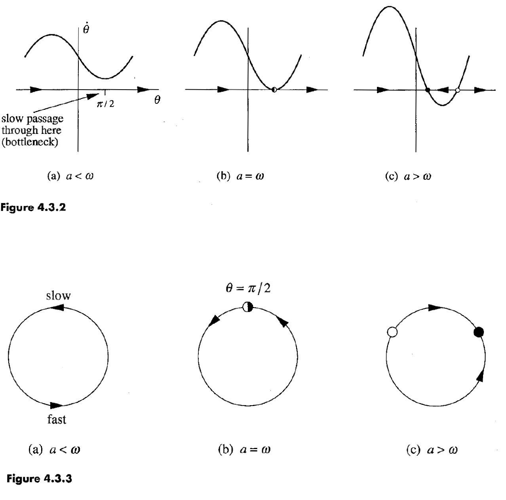

# Chapter 4
## Flows on the Circle

------------------------------------------------------------

## 4.0 Introduction

Upgrade from $\dot x = f(x)$, vector field on line, to $\dot \theta = f(\theta)$, vector field on circle.

What is special about vector fields on the circle?
: Periodic solutions become possible! This is the most basic model of oscillatory systems.

------------------------------------------------------------

## 4.1 Examples and Definitions

Example 1) $\dot \theta = \sin \theta $
- Same example we saw at the start, but now much simpler, one stable fixed point at $\pi$ and one unstable fixed point at $0$.

Example 2) $\dot \theta = \theta$ won't work on circle, because of discontinuity (however you choose the domain).

Define vector field on circle as a rule assigining unique velocities to each point on circle.

When do vector fields arise?
- When we have a $2\pi$-periodic function $f$ (that is smooth enough for our existence and uniqueness theorems)

------------------------------------------------------------

## 4.2 Uniform Oscillators

Simplest oscillator is $\dot \theta = \omega $
with solution $\theta(t)=\omega t + \theta_0$

Comments on periodicity

Note: absence of amplitude (this would be a second degree of freedom and we're still in 1D phase space)

Example) How often do two uniform oscillators (with different periods) intersect?
Illustrates **beat phenomenon**, when two non-interacting oscillators of different frequencies periodically go in and out of phase with eachother.

------------------------------------------------------------

## 4.3 Nonuniform Oscillator

Key equation: $ \dot \theta = \omega - a \sin \theta$

This arises in:
- Electronics (phase-locked loops)
- Biology (oscillating neurons, firefly flashing rhythm, circadian rhythm)
- Condensed-matter physics (Josephson junction, charge-density wave)
- Mechanics (Overdamped pendulum driven by a constant torque)

Assuming $\omega > 0$, $a\gte 0$ for convenience.

Cases:
1. $a=0$: reduces to uniform oscillator.
2. $a<\omega$: it will make oscillator speed up near $\theta = -\pi/2$ and slow down near $\theta=\pi/2$ (bottleneck).
3. $a=\omega$: system stops oscillating. Half-stable fixed point at $\pi/2$
4. $a>\omega$: the fixed point splits into stable and unstable fixed points. All trajectories end up at stable fixed point.

#### Example) Analyzing fixed points of case (4) above.

#### Oscillation Period
Can be found analytically by integrating

$$ T = \frac{2\pi}{\sqrt{\omega^2-a^2}} $$

What kind of scaling law behavior does this exhibit near the singular point?
- $\sqrt{\omega^2-a^2}=\sqrt{2\omega}\sqrt{\omega-a}$ as $a\rightarrow \omega^-$
- $T \sim (a_c-a)^{-1/2}$ as $a\rightarrow \omega^-$

#### Ghosts and bottlenecks

Square-root scaling laws are universal for systems near saddle-node bifurcations
- Saddle-node remnant (a **ghost**) leads to slow passage.

How long does the system spend in a bottleneck?  {{i.e. derive the universality of the square-root scaling law}}
- Parabolic approximation of $\dot \theta$ near bottleneck (minimum): $\dot x = r+x^2$
- Approximate time as $T_{\text{bottleneck}}=\int_{-\infty}^{\infty} \frac{dx}{r+x^2} = \frac{\pi}{\sqrt{r}}$

------------------------------------------------------------

## 4.4 Overdamped Pendulum

Overdamped pendulum: $ mL^2\ddot\theta + b\dot \theta = mgL\sin\theta=\Gamma $
- $m$: mass
- $L$: length of pendulum
- $b$: viscous damping
- $g$: gravitational acceleration
- $\Gamma$: applied torque (Taken to be $>0$, for counterclockwise rotation)

Take overdamped limit $b>>1$ to drop the second-order term

Dimensionalize it to get: $\frac{d\theta}{d\tau}=\gamma-\sin\theta$
- $\tau=\frac{mgL}{b}t$
- $\gamma = \frac{\Gamma}{mgL}$

Different cases:
- $\gamma>1$: applied torque never balanced by gravity; will rotate fully forever slower at $\pi/2$ & faster at other side
- $\gamma\rightarrow 1^+$: slower and slower peaking at $\pi/2$
- $\gamma=1$: fixed point at $\pi/2$
- $\gamma<1$: fixed point splits into two, lower of which is stable.

------------------------------------------------------------

## 4.5 Fireflies

#### Experimental backdropp: Hanson (1978)
- Periodically flash lights at firefly.
- If period is within some range of firefly's own period, it will try to synchronize (firefly is **entrained**)
- If period is too far from the range, a kind of beat phenomenon will occur, but nonuniform, with the firefly trying to synchronize: **phase walkthrough/drift**

#### Model: Ermentrout & Rinzel (1984)
- $\theta(t)$ is phase of firefly flashing; $\theta=0$ is a flashed
- In absence of stimuli, $\dot \theta = \omega$, uniform oscillation
- Introduce periodic stimulus with phase $\Theta$ such that $\dot\Theta=\Omega$, where $\Theta$ is the flash of this signal.
- To encode assumptions that firefly tries to match speeds, we impose $\dot\theta=\omega+A\sin(\Theta-\theta)$
- *Resetting Strength*, $A>0$, measures firefly's ability to modify instantaneous frequency.

#### Analysis
- We're interested in the dynamics of the phase difference $\phi=\Theta-\theta$
- $\dot \theta =\dot\Theta-\dot\theta=\Omega-\omega-A\sin\phi$, a nonuniform oscillator
- Nondimensionalize to get $\phi'=\mu-\sin\phi$, where
  - $\tau=At$
  - $\mu=\frac{\Omega-\omega}{A}$, frequency difference relative to resetting strength

Cases:
- $\mu=0$: stable fixed point at $0$, phases align perfectly; unstable fixed point at $\pi$
- $0<\mu<1$: fixed points come together, stable fixed point now is greater than $0$.
  - We say the rhythm is *phase-locked* to the stimulus: same frequency but not in unison
- $\mu=1$: saddle-node bifurcation
- $\mu>1$: no fixed points, phase difference increases indefinitely (but not uniformly): **phase drift**

**Range of entrainment**
- Region $\omega-A\lte\Omega\lte\omega+A$ in which the firefly can become entrained.

**Period of phase drift**
- Calculate by $T_{\text{drift}}=\int dt$, reexpress in terms of $\dot\phi^{-1}$
- Gives: $T_{\text{drift}}=\frac{2\pi}{\sqrt{(\Omega-\omega)^2-A^2}$

#### More experiments
- At time textbook was published, $\omega$ and $A$ had not yet been calculated for fireflies.
- Note species differences. *Pteroptyx cribellata* can shift frequency $\omega$ toward drive frequency.

------------------------------------------------------------

## 4.6 Superconducting Josephson Junctions

#### Context
Josephson junctions are superconducting devices, capable of extremely high frequency voltage oscillations ($10^{10}-10^{11} cycles per seecond$)
- Need QM for origin of the effect
- Can describe dynamics of the junctions in classical terms

Physical background
- 2 superconductors with wave functions $\psi_{1,2}e^[i\phi_{1,2}}$ separated by weak connection
- Current can flow across because of tunneling of cooper pairs.

#### Josephson Relationship
Connect junction to DC current source, so constant current $I$ is driveen across it.

QM tells us (about the **supercurrent**)
- Below **critical current $I_c$**
  - No current will flow.
  - Phases of superconductors will be driven apart to constant difference $\phi=\phi_2-\phi_1$ satisfying:
    - **Josephson current-phase relation**: $I=I_c\sin\phi$. The phase difference increases with the **bias current**
- $I>I_c$: phase difference no longer maintained, voltage develops:
  - $V=\frac{\hbar}{2e}\dot\phi$

There will, in general, also be a displacement current (capacitor-like) and ordinary current (resistor-like).
- We can represent these by stringing them in parallel

Using Kirchhoff's voltage and current laws:
$$C\dot V+\frac{V}{R} + I_c\sin\phi=I$$

Expressing in terms of phase difference:
$$\frac{\hbar C}{2e}\ddot \phi + \frac{\hbar}{2eR}\dot \phi + I_c \sin \phi = I$$

This is a constantly driven damped pendulum!
| Pendulum                           | Josephson Junction                 |
| --------                           | ------------------                 |
| Angle $\theta$                     | Phase difference $\phi$            |
| Angular velocity $\dot \theta$     | Voltage $\frac{\hbar}{2e}\dot\phi$ |
| Mass $m$                           | Capacitance $C$                    |
| Applied torque $\Gamma$            | Bias current $I$                   |
| Daming constant $b$                | Conductance $1/R$                  |
| Maximum gravitational torque $mgL$ | Critical current I_c               |

Interlude on typical parameter values

#### Dimensionless formulation
We get: $ \beta \phi''+\phi'+\sin\phi=\frac{I}{I_c} $
- $\tau = \frac{2eI_cR}{\hbar} t$
- $\beta = \frac{2eI_cR^2C}{\hbar}$, the **McCumber parameter** (dimensionless capacitance)

#### Analysis in overdamped case
- $I<I_c$: Stable fixed point
- $I > I_c$: Periodic varying

#### $I-V$ curve

What is $\langle V \rangle$?
- $I \lte I_c $: $\langle V \rangle = 0$
- $I > I_c $: $\langle V \rangle = I_cR\sqrt{(I/I_c)^2-1}$

What changes when we stop underdamping?
- The curve can become **hysteretic**: we introduce a kind of inertia with $\beta$
- Mathematically: hysteresis occurs because of coexistence of stable fixed point and stable periodic solution.

Summary:
- Vector fields on line: Only fixed points
- Vector fields on circle: Only fixed points and periodic solutions but not simultaneously
