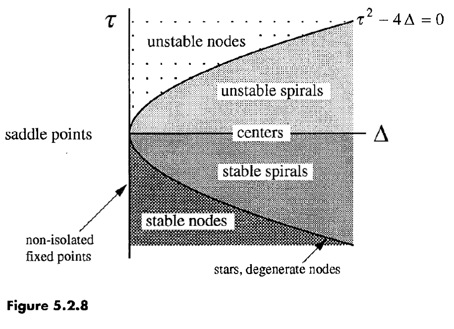

# Chapter 5
## Linear Systems

------------------------------------------------------------

## 5.0 Introduction

Focus: linear systems in two dimensions.
- Interesting in own right
- Play important role in classifying fixed points of nonlinear systems

------------------------------------------------------------

## 5.1 Definitions and Examples

Define **two-dimensional linear system**:
- $\dot x = ax + by$
- $\dot y = cx + dy$
- We could have written this in matrix form: $\dot \boldsymbol x = A\boldsymbol xj

What do we mean by **linear**?
- For two solutions, any linear combination thereof is also a solution.

How to visualize solutions?
- As trajectories moving on $(x,y)$ plane (the **phase plane**)

Example) Simple harmonic oscillator.
$$ m\ddot x + kx=0$$

How to analyze in phase space?

Identify **state** = $(x, v)$.
Then draw a vector at every position with value $(\dot x, \dot v)$.
- $\dot x = v$
- $\dot v = -\omega^2 x$

If we draw this, we get trajectories that are **closed orbits** (ellipses!) about the origin, which is a fixed point.
- These ellipses are equivalent to conservation of energy

#### Example

Uncoupled equations:
$\dot x = ax$
$\dot y = -1$

Varying a leads to:
- $a<0$: $(x,y)=(0,0)$ is a **stable node**
  - $a<-1$: slower approach along y than along x
  - $a=-1$: approach is same along both directions; $(x,y)=(0,0)$ is a symmetrical node or **star**
  - $-1<a<0$: slower approach along x than along y
- $a=0$: The $x$-axis is a **line of fixed points**
- $a>0$: The $y$-axis is attracted to an **unstable** node at the origin. All other points go to $x$-infinity at inifinite time, and to $y$-infinity at negative infinite time.
  - The origin, $x^*$, is, then, a **saddle node**
  - $y$-axis is stable manifold of
  - $x$-axis is unstable manifold of $x^*$

#### Stability Language

From previous example:
- $a<0$: the origin is an **(globally) attracting** fixed point
- $a\lte 0$: A point is **Liapunov staable** if all trajectories sufficiently close to that point remain close to it for all time.

Liapunov stable but not attracting: **Neutrally stable**
- Example: equilibrium point of SHO

Attracting but not Liapunov stable:
- A half-stable fixed point on a circle

Attracting and Liapunov stable: **(asymptotically) stable**

Not attracting nor Liapunov stable: **unstable**

------------------------------------------------------------

## 5.2 Classification of Linear Systems

Extending to coupled linear systems. (i.e., in matrix representation with non-diagonal terms).

Before, we had chosen the right basis to begin with, the straight-line trajectories are on the x and y axes.
Now, these straight-line trajectories may have a different form: we want to find the eigenvectors of our matrix $A$.
For an eigenvector $\boldsymbol v$, the straight-line solution will be $\boldsymbol x(t)=e^{\lambda t}\boldsymbol v$
- Sign of eigenvector is whether the solution decays or grows.

#### Case 1) 2 distinct eigenvectors, we span the entire plane, and we can write the general solution as a linera combination over these eigensolutions (by existence and uniqueness theorem).

Example of random matrix exercise: so much matrix diagonalization in physics jesus.

**Complex eigenvalues**?
- Fixed point will be either:
  - A **center**: surrounded by closed orbits
    - Neutrally stable;
    - Purely imaginary eigenvalues
  - Or a **spiral**, growing or decaying
    - Not pure imaginary

#### Case 2) 2 equal eigenvectors

If these correspond to different eigenvectors, we span the plane and every vector will be an eigenvector with the same eigenvalue (by linearity).
- This will give us a **star node** if the eigenvalue is non-zero
- The whole plane will consist of fixed points if the eigenvalue is zero

If there is only one eigenvector, then the fixed point is a **degenerate mode**
- At infinite times all trajectories become parallel to the one eigendirection
- We are at the border between a spiral and node.

What is the classification of fixed points?
- Stability: $\tau$
  - $\tau < 0$: stable
  - $\tau = 0$: centers
  - $\tau > 0$: unstable
- Type of fixed point: $\Delta$, $\tau$
  - $\Delta < 0$: saddle point (real e-vals with opp. signs)
  - $\Delta = 0$: non-isolated fixed points
  - $\Delta<\pm\tau^2/4$: node (real e-vals with same sign)
  - $\Delta=\pm\tau^2/4$: stars, degenerate nodes
  - $\Delta>\pm\tau^2/4$: spirals or centers (for $\tau = 0$)

Borderline cases: those fixed points occuring along lines in $(\Delta, \tau)$ space.
- Centers, stars, degenerate nodes, non-isolated fixed points
- Common in frictionless mechanical systems with energy conservation

------------------------------------------------------------

## 5.3 Love Affairs

Example of predator/prey dynamics but through perspective of Romeo & Juliet love affair.

Adds a more general twist.
